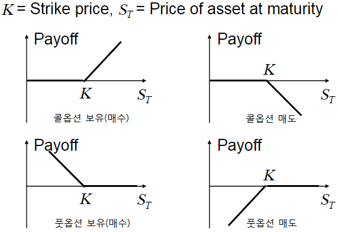

# 파생 상품 종류 정리
## 1. 파생상품 이란?
* 파생상품(Derivative)은 환율이나 금리, 주가 등의 시세변동에 따른 손실 위험을 줄이기 위해 일정 시점에서 일정한 가격으로 주식과 채권과 같은 전통적인 금융상품을 기초자산으로 하여, 새로운 현금흐름을 가져다주는 증권을 말한다. 기초 자산은 금융 상품이 아닌 일반 상품 등도 가능하며, 대표적인 파생상품으로는 선도거래(Forward), 선물(Future), 옵션(Option), 스왑(Swap)등이 있다. 파생상품의 주요목적은 헤지를 통한 위험 관리, 투자 목적 등이 있다. 

## 2. Fx Future(선물 환, 통화 선물)
  * 정의 : 통화(Currency)를 기초 자산으로 하고, '선도'의 손익을 가지는 거래
  * 일정한 물량의 통화를 미래 특정 시점(만기일)에 특정 환율(선도 확률)로 사거나 파는(매입/매도)계약을 말한다. 이때 주의 해야 될 것은 사거나 팔아야 하는 의무가 주어진다는 점이다.(이는 의무가 주어지는 옵션과는 다르다.)
  * 손익 구조
    * 계약 조건 : USD 10만 달러를 3개월 후에 1,250으로 매입하는 계약
    * 가정1) 만약 3개월 후 환율이 1,240원이 되었다면?
      *  이미 계약이 1,250원으로 사기로 계약이 되어 있기 때문에 꼭 1,250원에 거래를 해야한다.
      *  결과 : 1달러당 10원(1,240 - 1,250) * 10만달러 = -100만원(손해)
    * 가정2) 만약 2개월 후 환율이 1,265원이 되었다면?
      *  이미 1,250원에 사기로 되어 있기 때문에 1,250원에 거래
      *  결과 1달러당 15원(1,265 - 1,250) * 10만달러 = 150만원(이익)  
    * 매입이 아닌 매도 포지션일 경우 가정1)은 100만원 이익, 가정2)는 150만원 손해가 된다.  
  * 통화 선물의 이론가 공식
    * 예시) 가정 : 1년 후 8만달러를 수입 결재 해야되는 A 고객과 B고객
      * A 고객 : 통화 선물을 계약하고 원화는 통장에 넣어둠, KRW 이자율 - 5%
        * 1년뒤 찾은 원화 금액을 대가로 이미 계약된 선도 환율에 의해 받는 달러 금액 =  KRW 1억원 * (1 + 0.05 * 365/365 ) / 선도 환율
      * B 고객 : 달러를 사서 외화 예금에 넣어둠, USD 이자율 - 7%
        * 외화 예금을 넣은 뒤 1년 후 찾은 달러 금액 =   (KRW 1억원/1,250 달러) * (1 + 0.07 * 365/360)
    * 선도 환율은 A고객과 B고객을 공정하게 만들어주는 이론가격(1,225.52원)을 유도 가능    
    * 통화 선물 이론가격 결정식
   $$ 
   선도 환율 = 현물 화율 * \frac{1 + 비교 통화(KRW)금리 * 일수}{1 + 기준 통화(USD) 금리 * 일수}
   $$
   
## 2. 옵션(Vanilla Option)
  * 옵션 정의 : 어떠한 기초 자산(통화, 주식 등)을 일정한 시점(만기일)에서 미리 정한 가격(행사가)으로 사거나 팔 수 있는 권리를 거래하는 계약으로 선물(선도)와는 다른 점은 옵션의 매수자에게 권리가 주어지고 옵션의 매도자에게는 매수자의 결정에 따라 이행해야 하는 의무가 주어진다. 
  * 풋 옵션 : 옵션 만기일에 특정 상품을 정해진 가격대로 판매 할 수 있는 권리
    * 예시) 삼성 전자 1주의 주식이 50,000원이라고 가정하자 A는 한달(만기일) 위 50,000원(행사가)에 팔 수 있는 권리인 풋 옵션을 B에게 판매 했고 이때 B는 A에게 프리미엄을 지급한다. 한달 뒤 주식 가격을 51,000원으로 상승 했고 50,000원에 팔 수 있는 권리를 소유한 B는 풋 옵션을 행사하는 것이 손해이므로 권리를 포기한다. 
    * 풋옵션 Pay off = $max(K-S_{T}, 0)$ where $S_{T}$ = 만기 시점(T) 가격, K = 행사가격
  * 콜 옵션 : 옵션 만기일에 특정 상품을 정해진 가격대로 구매 할 수 있는 권리
    * 예시) 삼성 전자 1주의 주식이 50,000원이라고 가정하자 A는 한달(만기일) 위 50,000원(행사가)에 살 수 있는 권리인 콜 옵션을 B에게 판매 했고 이때 B는 A에게 프리미엄을 지급한다. 한달 뒤 주식 가격을 51,000원으로 상승 했고 50,000원에 살 수 있는 권리를 소유한 B는 콜 옵션을 행사하면 1,000원의 이익을 볼 수 있으므로 권리를 행사하는 것이 유리하다. 
    * 콜옵션 Pay off = $max(S_{T}-K, 0)$ where $S_{T}$ = 만기 시점(T) 가격, X = 행사가격
  * 풋/콜 옵션의 Pay off의 그래프는 다음과 같다. 
    

    
  * 옵션의 가격 결정 요인은 "기초 자산 가격", "행사 가격", "이자율", "잔존 만기", "변동성"으로 요인에 따른 페이오프의 변화는 다음과 같다. 
<table>
    <tr>
        <td>구분</td>
        <td>콜옵션</td>
        <td>풋옵션</td>
    </tr>
    <tr>
        <td>기초 자산 가격</td>
        <td>기초 자산 가격이 높아지면 사는 권리의 가치는 비싸짐</td>
        <td>기초 자산 가격이 높아지면 파는 권리의 가치는 떨어짐</td>
    </tr>
    <tr>
        <td>행사 가격</td>
        <td>행사 가격이 높아지면 사는 권리의 가치는 떨어짐</td>
        <td>행사 가격이 높아지면 파는 권리의 가치는 비싸짐</td>
    </tr>
    <tr>
        <td>이자율</td>
        <td>이자율이 높아지면, 권리 행사시 줄 금액의 현재 가치가 작아짐</td>
        <td>이자율이 높아지면, 권리 행사시 받을 금액의 현재 가치가 작아짐</td>
    </tr>
    <tr>
        <td>잔존 만기</td>
        <td>만기까지 많이 남을 수록, 권리를 행사 할 가능성이 커지므로 권리의 가치는 비싸짐</td>
        <td>만기까지 많이 남을 수록, 권리를 행사 할 가능성이 커지므로 권리의 가치는 비싸짐</td>
    </tr>
    <tr>
        <td>변동성</td>
        <td>기초자산이 많이 변할 수록, 권리를 행사할 가능성이 커지므로 권리의 가치는 비싸짐</td>
        <td>기초자산이 많이 변할 수록, 권리를 행사할 가능성이 커지므로 권리의 가치는 비싸짐</td>
    </tr>
</table>

## Appendix. 단어 정리
* 차액거래(Arbitrage) => 추후 정리 할것
    * 두 개의 시장에서 가치가 다른 물건이 있을 때, 한 곳에서 사고 다른 곳에서 파는 방식으로 무위험 이익을 내는 것이다. 
## Reference
* 이재성, 금융수학개론, 청문각(2013)
* 신한은행 금융공학센터, 알기쉬운 장외 파생 상품 강의, 한나래(2013)
